# Baby Food — User Guide

A field guide for the two parents (or grandparents, or caregivers) sharing a Baby Food household. The app keeps your homemade purees, your feeding log, and your baby's milestones in one place — and stays in sync across both phones in real time.

> **TL;DR**
> 1. Sign in with your email link → create a household → add your baby.
> 2. Stock your **freezer** in **Inventory**.
> 3. Tap **Log** to record what your baby just ate. The cube count goes down automatically.
> 4. Invite your partner from **Settings** so you both see the same data.

---

## 1. Signing in

Open the app and tap into your email — there's no password. We'll send you a one-time magic link.

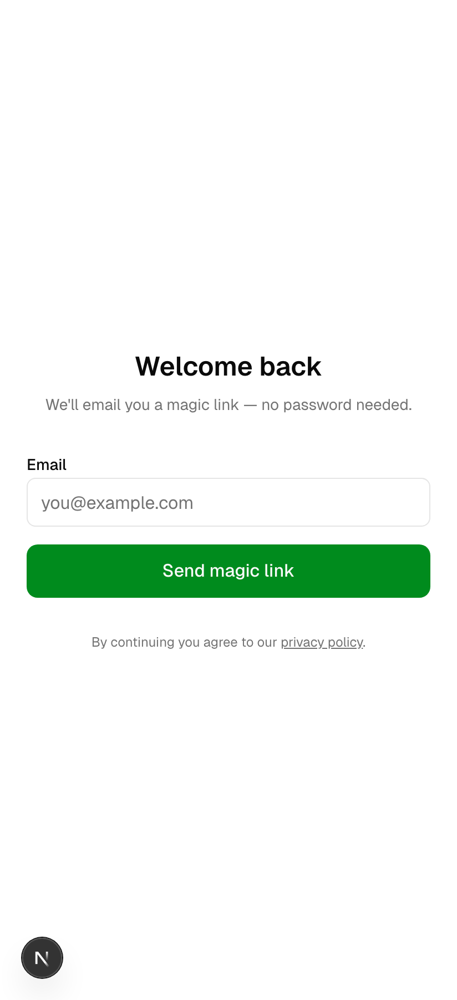

After you click the link in your email you'll arrive back here, signed in.

---

## 2. First-time setup (onboarding)

The first time you sign in you'll be asked to create a household, then add your baby. Both steps take ~30 seconds.

### Create the household

Pick a name. "The Smiths," "Mila's HQ," whatever — only you and your invited partner ever see it.

### Add your baby

Name and birth date. The birth date powers the **age in months** display and the food-readiness suggestions later on.

That's it. From now on you land on the dashboard.

---

## 3. The dashboard — your daily home base

Everything important shows up here, in this order:

- **Today** — your baby's name and current age
- **Quick log** — one-tap shortcuts that re-log the same food you logged last time
- **Streak** — how many days in a row you've logged at least one feeding
- **Last feeding** — what + when, with the mood
- **Expiring soon** — freezer cubes about to age out (top of the list = most urgent)
- **Next prep** — your next scheduled batch-cook session

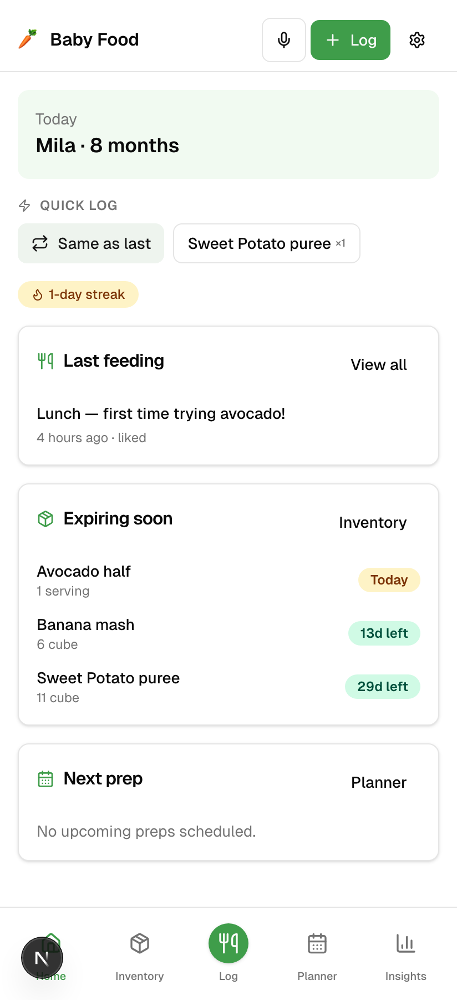

The **mic icon** in the header lets you voice-log a feeding hands-free — useful when you've got one hand on a spoon and the other on a wriggling baby. Just tap, say *"banana mash"* or *"two cubes of sweet potato"* and it logs.

The **+ Log** button takes you straight to the new-feeding form. The **gear** opens settings.

---

## 4. Stocking the freezer (Inventory)

Every time you batch-cook, add the result to inventory. The app then knows what's available and tracks it down to the last cube.

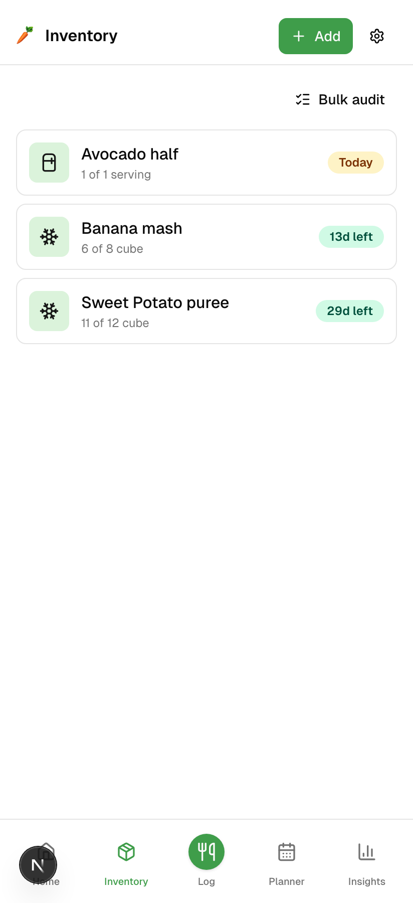

**The badges:**
- **Today / 2d / 13d left** — days until expiry, color-coded
- **Snowflake** — frozen
- **Fridge** — fridge-fresh

Tap **+ Add** to record a new batch:

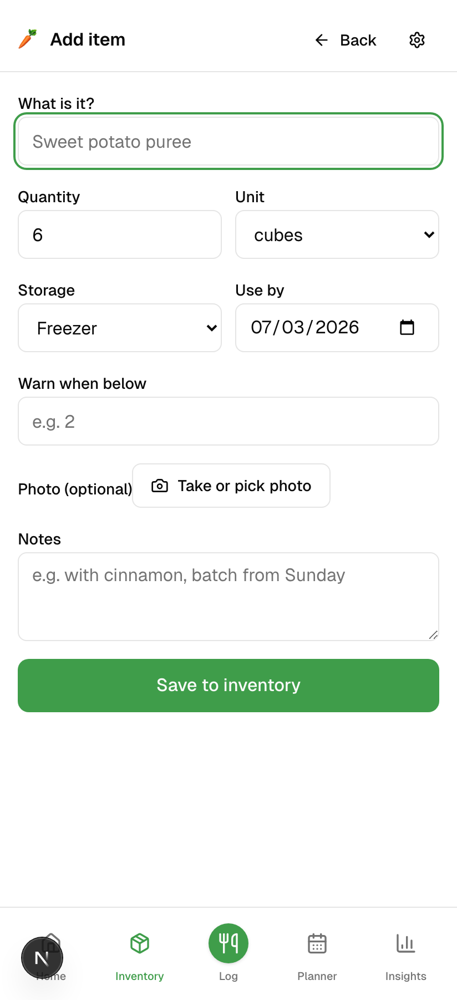

Pick the food, where it lives (fridge / freezer / pantry), how it's measured (cubes, jars, pouches, grams, ml, servings), how much you made, when it goes off, and optionally a low-stock threshold so you get warned before you run out.

**Bulk audit** (button at the top of the list) lets you correct counts in one screen — useful when you spot you actually only have *4* sweet-potato cubes left, not the 6 the app thinks.

---

## 5. Logging a feeding

The other half of the loop. Tap **Log** from anywhere in the app.

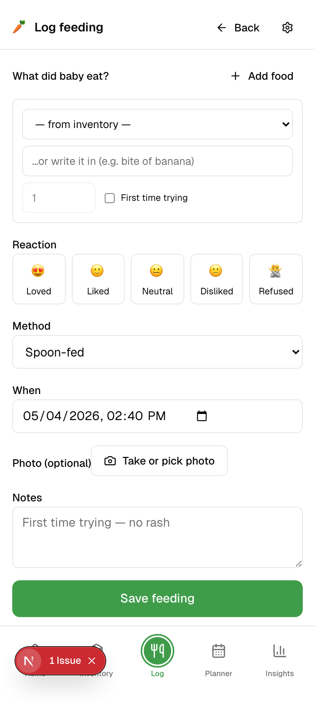

For each thing baby ate, pick from your inventory (which decrements the count automatically) or just type the food name in. Mark **First time trying** if it's a new food — that's how the app builds the allergen-introduction history.

You can also note:
- **Method** — spoon / self-feed / bottle / breast
- **Mood** — loved / liked / neutral / disliked / refused
- **Amount** — how much they actually ate
- **Notes** — anything memorable

Past feedings live on the timeline:

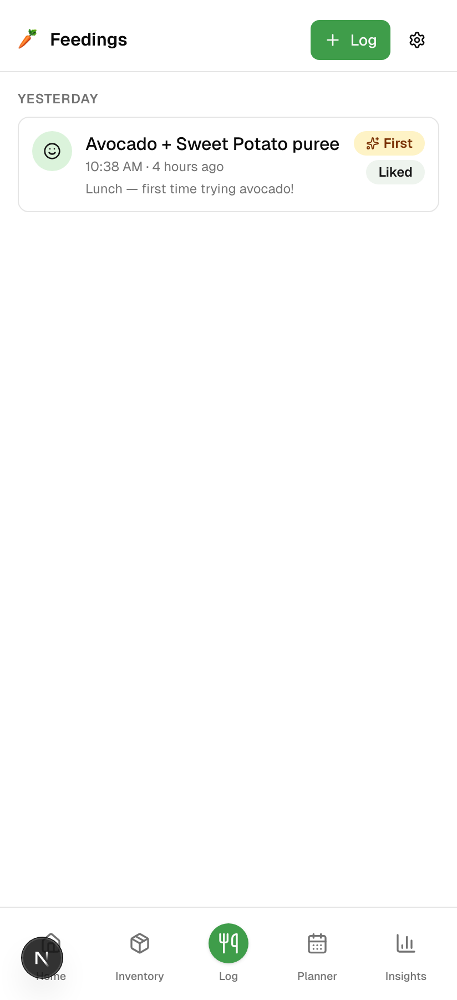

Tap any entry to see the full detail or edit it.

---

## 6. The food library

Before you can log a food, it needs to exist in your library. The library is your household's catalogue of every food you've introduced.

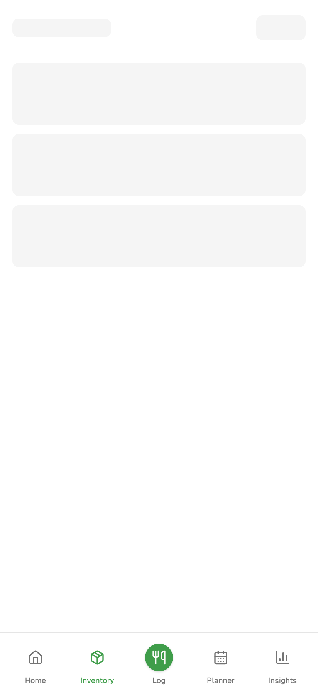

Each food has a name, category, minimum-age recommendation, allergen tags, and texture (puree / mash / soft / finger). The library also tracks **first-try history** — once you mark "first time trying" on a feeding, that food's status updates here.

---

## 7. Recipes

A recipe is the *how-to* for a food you make from scratch. Sweet potato puree, chicken & lentil mash, banana oat balls. Recipes can be saved, scheduled, and shared.

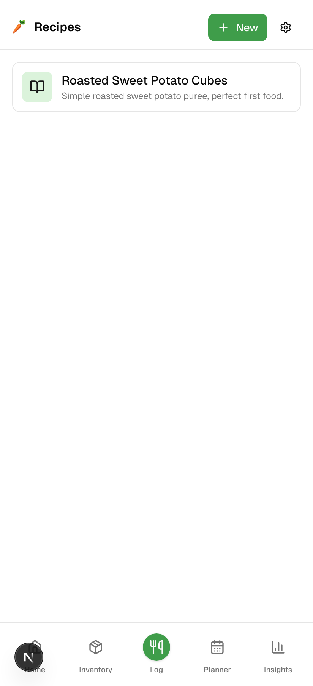

Tap **+ New** to add one:

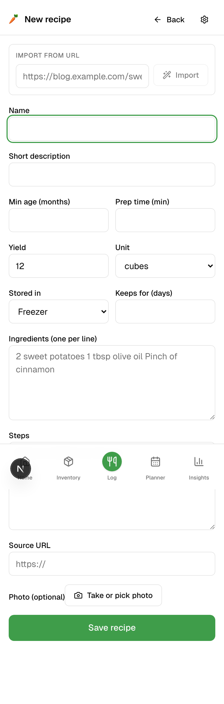

Fill in the name, ingredients, steps, prep time, and yield (e.g. *"this makes 12 cubes"*). When you cook it later, the planner can use that yield to auto-create the inventory line.

You can group recipes into **collections** (`/recipes/collections`) — e.g. *"6-month starters,"* *"freezer-friendly,"* *"things Mila actually likes"*.

---

## 8. The planner

Batch-cooking takes 90 minutes. The planner is where you book those sessions in advance so you're not scrambling at 9 PM with a screaming baby and an empty freezer.

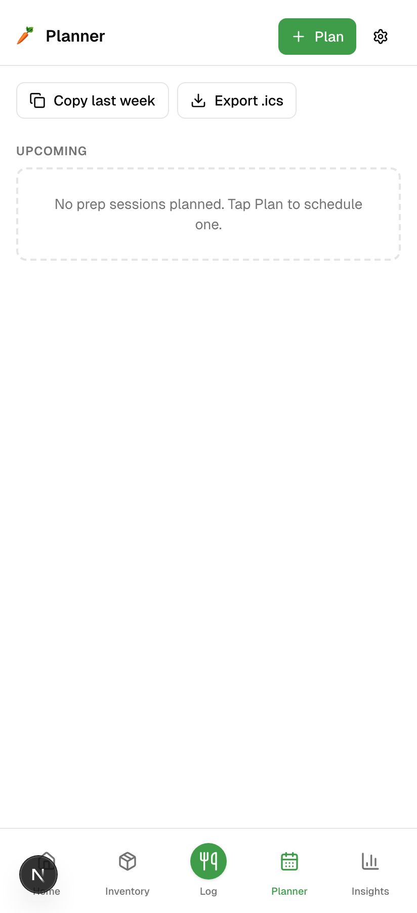

Tap **+ Plan** to schedule one. Pick a date, link a recipe (optional), and you'll see the prep on your dashboard's **Next prep** card. **Copy last week** clones the previous week's prep schedule. **Export .ics** sends a calendar invite to Google / Apple Calendar.

When you finish a prep, mark it **Done** — the app uses the recipe's yield to pre-fill an inventory line.

---

## 9. Shopping list

A running list of stuff to pick up next time you're at the store. Items added from a recipe or a prep plan tag automatically.

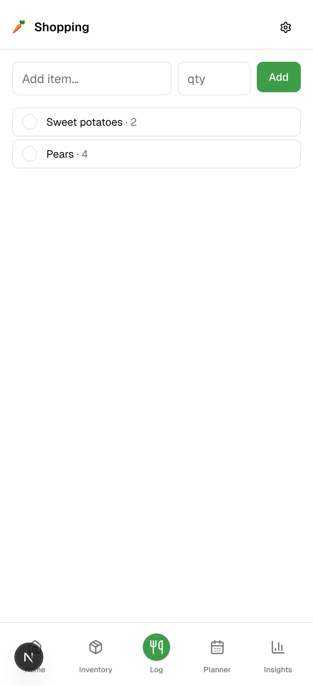

Tap an item to mark it complete — it strikes through and moves to the bottom.

---

## 10. Beyond food: Care, Growth, Memories

The app tracks more than just food. Every other category lives off the **Care** tab.

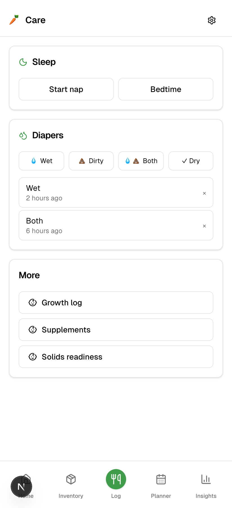

### Sleep
**Start nap** / **Bedtime** start a running timer. Tap again to stop it. Naps and night sleep are categorized separately so you can see real patterns.

### Diapers
One-tap logging: **Wet / Dirty / Both / Dry**. Recent changes show below with timestamps. Hand-off to a partner becomes "Hey, last diaper was 2 hours ago, wet."

### Supplements
For the daily **vitamin D** drop, **iron**, or anything else. Set a reminder cadence in settings and the app nudges you at the same time every day.

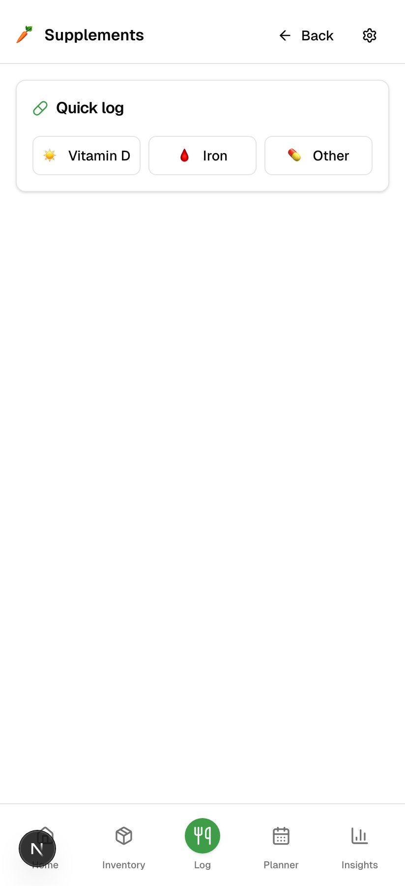

### Solids readiness
A 5-point checklist for "is your baby ready for solid food?" — sits unsupported, head control, lost the tongue-thrust reflex, shows interest, can grasp. Tracks the answers over time.

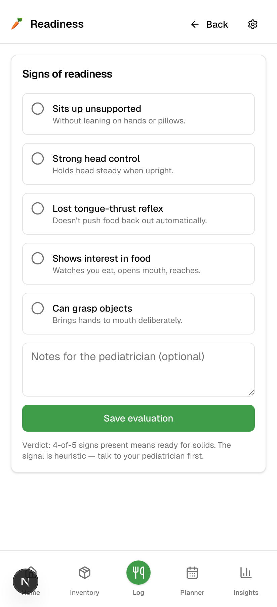

### Growth
Weight, length, head circumference. Plot it on a chart, see whether you're tracking your baby's curve. Useful between paediatrician visits.

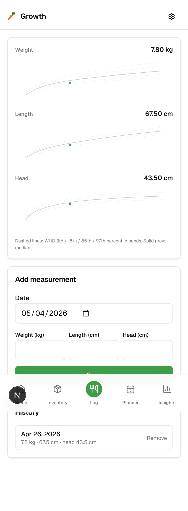

### Memories
Photos + captions tied to a date. The "first time trying X" feedings auto-suggest a memory. Useful for sharing with grandparents — see [the share-link section](#13-share-with-grandparents) below.

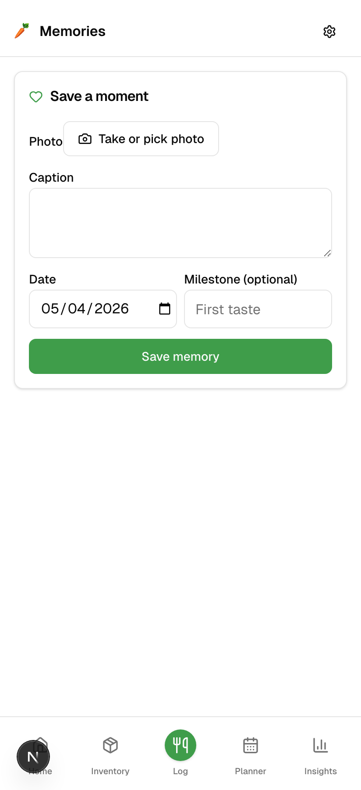

---

## 11. Insights

Charts that surface from the data you've logged: how many feedings per day on average, which foods Mila has rejected most, allergen-introduction progress, when you typically run low on inventory.

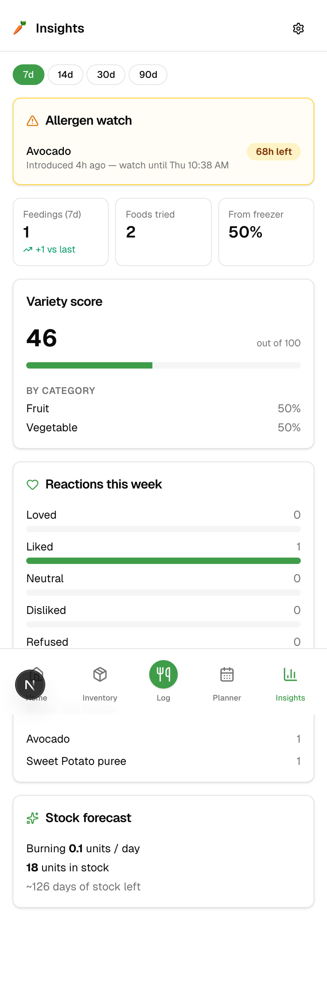

There's also an **Activity** feed showing who logged what and when — handy for the partner who wasn't there.

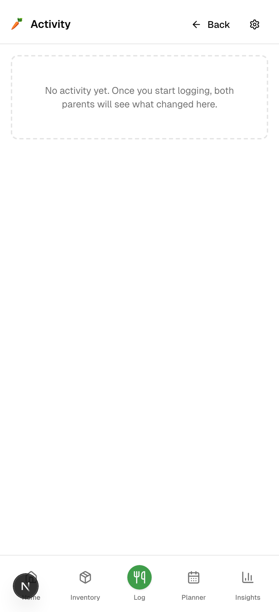

---

## 12. Inviting your partner

Open **Settings**.

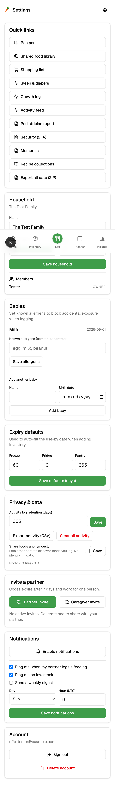

Find the **Invite** section, mint a code, and text it to your partner. They sign up and enter the code — they're now in the same household and see the same data, in real time. Anything either of you logs shows up immediately on both phones.

You can mint two flavors of invite:

- **Member** — full access (the typical "other parent" invite)
- **Caregiver** — can view + log but can't mint invites or change settings (for grandparents, nannies)

Codes expire in 7 days unless you set a different limit. You can revoke them at any time.

---

## 13. Share with grandparents (read-only)

For people you don't want to give app access to, mint a **share link** instead. Settings → Share. Pick a scope (feedings only / growth only / memories / everything), get a URL, send it. Anyone with the link sees a read-only view of the chosen data — no signup required, no ability to change anything.

Links expire in 90 days by default. Revoke any time.

---

## 14. Settings, security, account

The full settings screen has more than just invites:

- **Theme color** + accent emoji — the carrot at the top is yours to change
- **Theme mode** — light / dark / system
- **Units** — metric or imperial (affects growth)
- **Default expiry windows** — how long fridge / freezer / pantry foods are good for by default
- **Notifications** — partner-logged-a-feeding, low-stock, weekly digest
- **Push notifications** — opt in to phone push
- **Shared foods** — opt in to anonymously contribute "what Mila ate at 8mo" to the community catalogue (helps surface food ideas for other parents)

For 2FA and account deletion, head to `/settings/security`:

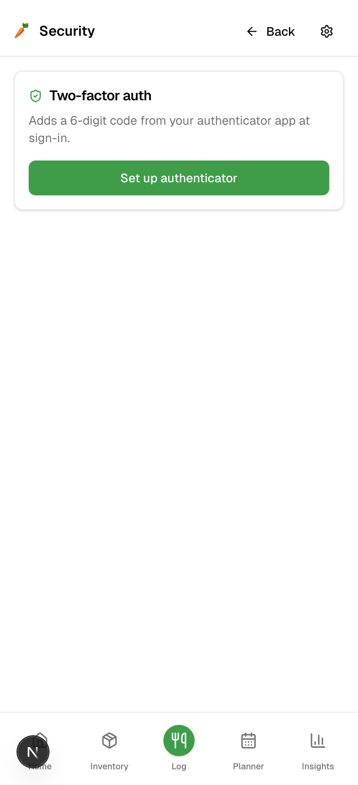

- **Two-factor auth** — scan a QR with your authenticator app. Once enabled, you'll be asked for a 6-digit code on every sign-in.
- **Delete account** — wipes your data. If you're the only owner of a household it's deleted too. If your partner is also an owner, you just leave.

---

## 15. Tips & shortcuts

- **One-handed logging** — voice icon in the header. Say *"banana"*, *"2 cubes of pear"*, *"first time trying yogurt"*.
- **Same as last** — on the dashboard, the **Same as last** quick-log button repeats the previous feeding in one tap. Good for snacks/repeated meals.
- **Streak** — log at least one feeding per day to keep it going. Mostly for fun.
- **Offline** — if you log while offline (e.g. at the park), the app queues it and syncs the moment you're back online. The yellow banner tells you when something's queued.
- **Install as an app** — on your phone, "Add to home screen" from your browser menu. The app opens fullscreen, no browser bar, like any native app.
- **Sharing photos** — when your phone has a photo from the camera, "Share" → Baby Food. The photo lands directly in **Memories**.

---

## 16. FAQ

**My partner says they invited me but I'm not seeing the data.**
Make sure you tapped **Join household** on `/onboarding` (or `/onboarding/join?code=…`), not **Create household**. If you accidentally created a second household, sign out, ask for a fresh invite, and join.

**An inventory cube didn't decrement after I logged it.**
The auto-decrement only happens when you pick the cube from the **inventory dropdown** in the new-feeding form. If you typed the food name in by hand instead, the app doesn't know which cube you used. Edit the feeding → pick from inventory → it'll subtract retroactively.

**The "First time trying" badge is wrong.**
First-try is a per-food, per-baby flag. Once any feeding marks a food as first-try it stays in the introduction history. To re-do it, edit the prior feeding and untick the box, then tick it on the right one.

**My grandparent's link expired and they're upset.**
Settings → Share → mint a fresh one. Old links are dead, no way to revive.

**I log feedings every day but the streak says zero.**
Streak resets at midnight in your phone's timezone. If you're up past midnight feeding overnight, log it before midnight or it'll roll over.

**Can I delete a baby?**
Yes — but it cascades to *all* their feedings, growth measurements, milestones, etc. There's no undo. Settings → Babies → trash icon. Use it carefully.
